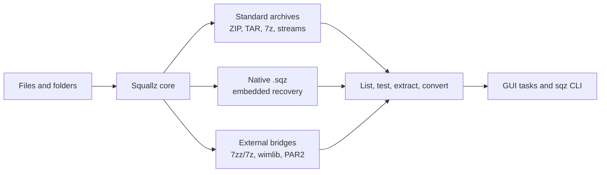
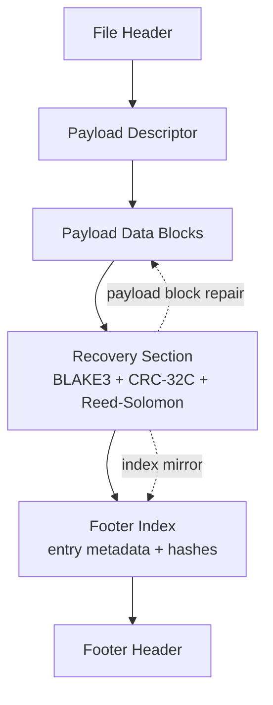
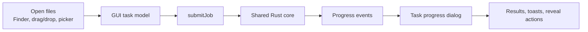

# Squallz

<p align="center">
  
</p>

<p align="center">
  A desktop and CLI archive manager with a native self-recovery container.
</p>

<p align="center">
  <a href="README.zh-CN.md">Chinese README</a> |
  <a href="docs/format-support.md">Format support</a> |
  <a href="docs/sqz-container-format-v1.md">SQZ format</a> |
  <a href="docs/privacy.md">Privacy</a>
</p>

Squallz is a Rust-first archive tool with two front doors: a Tauri/Svelte
desktop app and a scriptable `sqz` CLI. The archive business logic lives in
shared Rust core, format, and recovery crates, so GUI and CLI workflows stay
aligned instead of drifting into separate implementations.

The project is in a polish and hardening phase. The goal is dependable archive
workflows, clear boundaries, local privacy, and a reliable `.sqz` container, not
feature sprawl.

## At a Glance



| Area | What Squallz does |
| --- | --- |
| Desktop app | Tauri desktop UI with shared task progress, theme settings, history, passwords, drag/drop, and platform shell handoff paths. |
| CLI | `sqz` supports archive creation, extraction, listing, testing, conversion, nested archives, checksums, duplicate scans, batch jobs, diagnostics, and JSON output. |
| Native container | `.sqz` stores entries with footer indexes, checksums, embedded Reed-Solomon recovery, split volumes, and standard archive export. |
| Safety | Centralized extraction guardrails for path traversal, Zip Slip, symlink breakout, output limits, entry limits, and compression-ratio limits. |
| Privacy | No ads, no telemetry, no file uploads. Saved archive passwords go through the system credential store only when the user opts in. |

## Format Boundaries

Squallz is explicit about what is built in, what depends on external tools, and
what is intentionally unsupported.

| Capability | Current boundary |
| --- | --- |
| Built-in archive work | ZIP/ZIP64, TAR, 7z, and single-stream compressors such as gzip, bzip2, xz, zstd, lz4, and brotli. |
| Native `.sqz` | Create, list, test, extract, repair within recovery limits, split volumes, and export to standard archives. |
| WIM | Create/read paths exist through external tooling, primarily `wimlib-imagex` and 7zz/7z where available. Not bundled by default. |
| Long-tail unpack-only formats | APFS, AR, ARJ, CAB, CHM, CPIO, CramFS, DMG, EXT, FAT, GPT, HFS, IHEX, ISO, LZH, LZMA, MBR, MSI, NSIS, NTFS, QCOW2, RPM, SquashFS, UDF, UEFI, VDI, VHD, VHDX, VMDK, XAR, and Z through the 7zz/7z bridge when installed. |
| RAR | Read-only bridge path. Squallz does not create RAR, does not implement RAR recovery records, and does not claim damaged RAR repair. |
| External recovery | PAR2 verify/repair has a Rust fallback and optional external bridge. PAR2 create uses an external standard tool when present. |

Run the machine-readable inventory at any time:

```sh
sqz info --json
sqz doctor --json
sqz doctor --strict
```

## Why `.sqz`

`.sqz` is Squallz's native recovery container. It is designed for archives that
should remain inspectable, testable, and repairable without inventing a closed
or RAR-compatible format.



Current `.sqz` highlights:

- Entry-set containers plus inner `zip`, `tar`, `7z`, and `zstd` profiles.
- Embedded Reed-Solomon recovery over payload blocks.
- Footer-index mirror for recovering directory metadata in supported damage cases.
- `RSPC` protection for the recovery section itself.
- `.sqz.001/.002/...` split volumes with `SQZV` headers.
- `.sqz.rev001/.rev002/.rev003` sidecars for split-volume parity, with documented recovery limits.
- Export to standard formats such as ZIP, 7z, TAR, and TAR.ZST through shared engines.

See [docs/sqz-container-format-v1.md](docs/sqz-container-format-v1.md) for the
binary format contract and damage-boundary details.

## CLI Examples

Create and inspect a standard archive:

```sh
sqz compress ./Photos -o Photos.zip --profile balanced
sqz list Photos.zip --tree
sqz test Photos.zip --json
sqz extract Photos.zip -d ./Restored --smart
```

Create a self-recovery `.sqz` container:

```sh
sqz pack ./Project -o Project.sqz --recovery 25% --inner-format zstd
sqz test Project.sqz --json
sqz repair Project.sqz -o Project.repaired.sqz --json
sqz export Project.repaired.sqz -o Project.zip
```

Work with safety, encoding, and automation:

```sh
sqz extract legacy.zip -d out --encoding gbk --max-output-bytes 2g
sqz checksum ./release -a blake3
sqz checksum --check SHA256SUMS
sqz duplicates ./Downloads --min-size 1m --json
sqz batch jobs.json --keep-going --json
```

Convert without manually extracting to disk:

```sh
sqz convert source.zip -o source.7z --profile maximum
sqz export archive.sqz -o archive.tar.zst
```

## Desktop App



The GUI is a Tauri app backed by the same archive engine as the CLI. It focuses
on a small set of dependable desktop workflows:

- Open archives, browse entries, preview supported files, and extract safely.
- Compress, convert, test, checksum, repair, and export through shared task jobs.
- Use light/dark themes, accent palettes, reduced-motion-aware UI, and localized
  English/Chinese text.
- Store passwords only through the OS credential store when the user explicitly
  chooses to remember a password.
- Install or generate platform shell integrations without silently taking over
  archive ownership.

macOS Finder Quick Actions are the active packaged integration path. Windows
Explorer and Linux file-manager assets are generated and documented, with
remaining platform-specific release boundaries tracked in
[docs/platform-integration.md](docs/platform-integration.md).

## Build and Development

Prerequisites:

- Rust toolchain with Cargo.
- Node.js and npm for the Svelte/Tauri frontend.
- Platform requirements for Tauri if you are building the desktop app.
- Optional external tools for bridge-backed formats: `7zz`/`7z`, `wimlib-imagex`,
  and a standard `par2` tool.

Install frontend dependencies:

```sh
make install
```

Build and test core paths:

```sh
cargo build --workspace
cargo test --all
```

Run the desktop app in development:

```sh
make dev
```

Package the app for the current platform:

```sh
make app-release
```

## Unsigned Downloads and Builds

This section is for users who download prebuilt Squallz binaries or installers,
and it also applies to packages produced locally with `make app-release`.
Current downloadable and preview desktop builds are not code-signed or notarized
yet. Archive handling and CLI behavior are unchanged, but the operating system
may block the app before it starts or warn when installing file-manager actions.

Only bypass these warnings for an app bundle or binary you built yourself, or
for a download from a source you trust. If a checksum is published next to the
download, compare it before bypassing the operating-system warning. If you are
not sure where the binary came from, delete it and build from source instead.

Release artifacts produced by the GitHub Actions release workflow include
`SHA256SUMS` and GitHub Artifact Attestations. After downloading a file, verify
the checksum and build provenance before bypassing operating-system warnings:

```sh
shasum -a 256 /path/to/downloaded-file
gh attestation verify /path/to/downloaded-file --repo yangzhg/Squallz
```

Compare the printed SHA-256 value with the matching line in `SHA256SUMS`.

### macOS

If Finder says the developer cannot be verified, or that Apple cannot check the
app for malicious software:

1. Verify that the download came from the expected release page, and compare the
   checksum if one is provided.
2. Move `Squallz.app` to `Applications` if you want to keep the app installed.
3. Control-click or right-click `Squallz.app`, choose **Open**, then confirm
   **Open** again.
4. If macOS still blocks it, open **System Settings** → **Privacy & Security**,
   then choose **Open Anyway** for Squallz.

If macOS says the app is damaged and cannot be opened after you have verified
the source, remove the quarantine attribute, then open the app again:

```sh
xattr -dr com.apple.quarantine /path/to/Squallz.app
```

If the downloaded `sqz` CLI binary is blocked or is not executable, verify the
source first, then run:

```sh
xattr -d com.apple.quarantine /path/to/sqz
chmod +x /path/to/sqz
```

### Windows

If Microsoft Defender SmartScreen shows "Windows protected your PC":

1. Verify that the download came from the expected release page, and compare the
   checksum if one is provided.
2. Choose **More info** → **Run anyway**.

If Microsoft Defender or another security tool quarantines the file, only
restore or allow it after you have verified the source and checksum. If you
cannot verify the binary, delete it and build Squallz from source instead.

### Linux

If the shell says `Permission denied`, or a downloaded AppImage/binary does not
start, make it executable:

```sh
chmod +x /path/to/Squallz
chmod +x /path/to/sqz
```

If your desktop environment asks whether to trust or integrate the downloaded
application, approve it only after verifying the source and checksum. If the
package manager or sandbox policy blocks the app, build from source or use the
native package format for your distribution.

Signed and notarized release artifacts are the expected path for future
distribution builds. Until then, treat downloaded unsigned binaries as preview
builds.

Project checks:

```sh
cargo fmt --all -- --check
cargo clippy --all-targets --all-features -- -D warnings
cargo test --all
npm --prefix frontend run check
npm --prefix frontend run build
```

## Repository Map

| Path | Purpose |
| --- | --- |
| `crates/squallz-core` | Shared archive workflows, input collection, filters, queues, volume handling, checksums, and safety limits. |
| `crates/squallz-formats` | Archive format implementations and external bridges. |
| `crates/squallz-format-api` | Format traits, entries, extraction contracts, safety helpers, and registry types. |
| `crates/squallz-recovery` | Recovery verification and repair support. |
| `crates/squallz-cli` | `sqz` command-line interface. |
| `crates/squallz-gui` | Tauri backend, desktop integration, jobs, settings, secrets, and IPC. |
| `frontend` | Svelte UI, design tokens, task dialogs, i18n, and frontend state. |
| `locales` | Built-in English and Chinese language packs. |
| `docs` | Format, privacy, platform, license, help, and release-boundary documentation. |
| `scripts` | Smoke tests, platform checks, release readiness, and UI audits. |

## Privacy and Trust

Squallz is designed as a local-first archive tool:

- No telemetry and no advertising.
- No upload of archive contents, file names, paths, passwords, recovery data, or
  operation history.
- No plaintext passwords in settings, localStorage, logs, normal task history, or
  diagnostic reports.
- External tools, when used, are invoked locally on user-selected files.

Read the full policy in [docs/privacy.md](docs/privacy.md).

## Non-Goals

- No RAR creation.
- No RAR recovery-record or `.rev` compatibility claim.
- No silent default-app takeover.
- No proprietary encoder with unclear patent or redistribution terms.
- No fake recovery claims beyond `.sqz`, ZIP rebuild, or PAR2 evidence.

## License

Squallz is distributed under the terms of either the
[MIT license](LICENSE-MIT) or the [Apache License 2.0](LICENSE-APACHE), at
your option. Dependency and external-tool license tracking lives in
[docs/licenses.md](docs/licenses.md).
