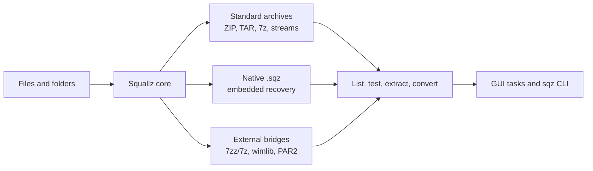
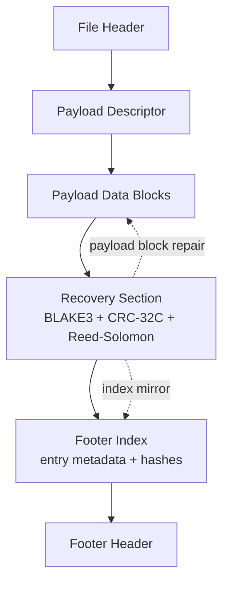
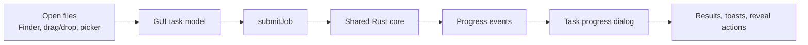

# Squallz

<p align="center">
  
</p>

<p align="center">
  A desktop and CLI archive manager with a native self-recovery container.
</p>

<p align="center">
  <a href="README.zh-CN.md">Chinese README</a> |
  <a href="docs/format-support.md">Format support</a> |
  <a href="docs/sqz-container-format-v1.md">SQZ format</a> |
  <a href="docs/SELF_EXTRACTING.md">SFX format</a> |
  <a href="docs/PRESETS.md">Archive presets</a> |
  <a href="docs/macos-release.md">macOS release</a> |
  <a href="docs/privacy.md">Privacy</a>
</p>

Squallz is a Rust-first archive tool with two front doors: a Tauri/Svelte
desktop app and a scriptable `sqz` CLI. The archive business logic lives in
shared Rust core, format, and recovery crates, so GUI and CLI workflows stay
aligned instead of drifting into separate implementations.

The project is in a polish and hardening phase. The goal is dependable archive
workflows, clear boundaries, local privacy, and a reliable `.sqz` container, not
feature sprawl.

## At a Glance


```mermaid
flowchart LR
  A["Files and folders"] --> B["Squallz core"]
  B --> C["Standard archives<br/>ZIP, TAR, 7z, streams"]
  B --> D["Native .sqz<br/>embedded recovery"]
  B --> E["External bridges<br/>7zz/7z, wimlib, PAR2"]
  C --> F["List, test, extract, convert"]
  D --> F
  E --> F
  F --> G["GUI tasks and sqz CLI"]
```

| Area | What Squallz does |
| --- | --- |
| Desktop app | Tauri desktop UI with shared task progress, theme settings, history, passwords, drag/drop, and platform shell handoff paths. |
| CLI | `sqz` supports archive and SFX creation, extraction, listing, testing, conversion, nested archives, checksums, duplicate scans, batch jobs, diagnostics, and JSON output. |
| Native container | `.sqz` stores entries with footer indexes, checksums, embedded Reed-Solomon recovery, split volumes, and standard archive export. |
| Safety | Centralized extraction guardrails for path traversal, Zip Slip, symlink breakout, output limits, entry limits, and compression-ratio limits. |
| Privacy | No ads, no telemetry, no file uploads. Saved archive passwords go through the system credential store only when the user opts in. |

## Format Boundaries

Squallz is explicit about what is built in, what depends on external tools, and
what is intentionally unsupported.

| Capability | Current boundary |
| --- | --- |
| Built-in archive work | ZIP/ZIP64, TAR, 7z, and single-stream compressors such as gzip, bzip2, xz, zstd, lz4, and brotli. |
| Native ZIP volumes | Built-in creation and conversion write PKWARE-compatible `.z01/.z02/…/.zip` sets and use the final `.zip` as the primary output. Existing sets are validated, located from any member, staged privately, and read through external 7zz/7z; encrypted-read passwords use stdin rather than process arguments or environment variables. |
| Native `.sqz` | Create, list, test, extract, repair within recovery limits, split volumes, and export to standard archives. |
| WIM | Create/read paths exist through external tooling, primarily `wimlib-imagex` and 7zz/7z where available. Not bundled by default. |
| Long-tail unpack-only formats | APFS, AR, ARJ, CAB, CHM, CPIO, CramFS, DMG, EXT, FAT, GPT, HFS, IHEX, ISO, LZH, LZMA, MBR, MSI, NSIS, NTFS, QCOW2, RPM, SquashFS, UDF, UEFI, VDI, VHD, VHDX, VMDK, XAR, and Z through the 7zz/7z bridge when installed. |
| RAR | Read-only bridge when external 7zz/7z is installed. Encrypted and plain `partN.rar` and legacy `.rar/.r00`–`.r99` sets can open from any member through the stdin-only password path; real encrypted RAR, RAR4, and full three-platform coverage are not release-claimed. Squallz does not create RAR, implement RAR recovery records, or repair damaged RAR. |
| Self-extracting archives | SFX v1 assembles a complete ZIP payload with a Squallz-aware Windows PE/Linux ELF stub or a macOS GUI `.app` template. The CLI and desktop Create page support the host target; the final artifact must be signed after assembly. |
| External recovery | PAR2 verify/repair has a Rust fallback and optional external bridge. PAR2 create uses an external standard tool when present. |

Run the machine-readable inventory at any time:

```sh
sqz info --json
sqz doctor --json
sqz doctor --strict
```

## Why `.sqz`

`.sqz` is Squallz's native recovery container. It is designed for archives that
should remain inspectable, testable, and repairable without inventing a closed
or RAR-compatible format.


```mermaid
flowchart TB
  H["File Header"] --> P["Payload Descriptor"]
  P --> D["Payload Data Blocks"]
  D --> R["Recovery Section<br/>BLAKE3 + CRC-32C + Reed-Solomon"]
  R --> I["Footer Index<br/>entry metadata + hashes"]
  I --> F["Footer Header"]
  R -. "index mirror" .-> I
  R -. "payload block repair" .-> D
```

Current `.sqz` highlights:

- Entry-set containers plus inner `zip`, `tar`, `7z`, and `zstd` profiles.
- Embedded Reed-Solomon recovery over payload blocks.
- Footer-index mirror for recovering directory metadata in supported damage cases.
- `RSPC` protection for the recovery section itself.
- `.sqz.001/.002/...` split volumes with `SQZV` headers.
- `.sqz.rev001/.rev002/.rev003` sidecars for split-volume parity, with documented recovery limits.
- Export to standard formats such as ZIP, 7z, TAR, and TAR.ZST through shared engines.

See [docs/sqz-container-format-v1.md](docs/sqz-container-format-v1.md) for the
binary format contract and damage-boundary details.

## CLI Examples

Create and inspect a standard archive:

```sh
sqz compress ./Photos -o Photos.zip --profile balanced
sqz list Photos.zip --tree
sqz list Photos.zip --search "RAW/2026" --json
sqz test Photos.zip --json
sqz extract Photos.zip -d ./Restored --smart
sqz preset list
sqz preset clone builtin.create.cross-platform-7z user.create.portable --label "Portable"
```

Create and verify a Windows or Linux self-extractor from a complete ZIP
payload:

```sh
sqz sfx create Photos.zip --target windows --stub sqz.exe -o Photos.exe
sqz sfx create Photos.zip --target macos --stub Squallz.app -o Photos.app
sqz sfx inspect Photos.exe
```

The runtime can list, test or safely extract the payload and never auto-runs
archived code. Build first, sign the final executable afterward. The layout and
macOS signing boundary are documented in
[docs/SELF_EXTRACTING.md](docs/SELF_EXTRACTING.md).

Create a self-recovery `.sqz` container:

```sh
sqz pack ./Project -o Project.sqz --recovery 25% --inner-format zstd
sqz test Project.sqz --json
sqz repair Project.sqz -o Project.repaired.sqz --json
sqz export Project.repaired.sqz -o Project.zip
```

Work with safety, encoding, and automation:

```sh
sqz extract legacy.zip -d out --encoding gbk --max-output-bytes 2g
sqz checksum ./release -a blake3
sqz checksum --check SHA256SUMS
sqz duplicates ./Downloads --min-size 1m --json
sqz batch jobs.json --keep-going --json
```

Show the installed CLI version or check the stable release channel:

```sh
sqz --version
sqz check-update
sqz check-update --json
```

`sqz --version` is local and does not make a network request. `sqz
check-update` only reads stable-release metadata; it does not download or
install an update package. Its normal `up_to_date`, `update_available`, and `ahead`
results all exit with code 0, including an available release that has no
matching package for this platform. This command is separate from `sqz update`,
which edits entries in an existing archive.

Convert without manually extracting to disk:

```sh
sqz convert source.zip -o source.7z --profile maximum
sqz convert source.zip -o source.7z --profile balanced --split 700m
sqz convert source.7z -o source.zip --split 700m --split-mode native
sqz export archive.sqz -o archive.tar.zst
```

Conversion and export refuse an existing output by default. Split conversion
publishes generic `.001/.002/...` volumes by default; native ZIP mode publishes
`.z01/.z02/.../.zip`. Both layouts report every physical output. Add `--force` only after
choosing to replace the destination: Squallz binds that exact file or numbered set before work starts
and returns `destination_changed` instead of overwriting it if another process
modifies it before commit.

## Desktop App


```mermaid
flowchart LR
  A["Open files<br/>Finder, drag/drop, picker"] --> B["GUI task model"]
  B --> C["submitJob"]
  C --> D["Shared Rust core"]
  D --> E["Progress events"]
  E --> F["Task progress dialog"]
  F --> G["Results, toasts, reveal actions"]
```

The GUI is a Tauri app backed by the same archive engine as the CLI. It focuses
on a small set of dependable desktop workflows:

- Open archives, browse entries, preview supported files, and extract safely.
- Compress, convert, test, checksum, repair, and export through shared task jobs.
- Save versioned create and extract presets, with separate app and file-manager
  bindings and no passwords or job paths in preset JSON.
- Use light/dark themes, accent palettes, reduced-motion-aware UI, and localized
  English/Chinese text.
- Store passwords only through the OS credential store when the user explicitly
  chooses to remember a password.
- Install or generate platform shell integrations without silently taking over
  archive ownership.

macOS Finder Quick Actions are the active packaged integration path. Windows
Explorer and Linux file-manager assets are generated and documented, with
remaining platform-specific release boundaries tracked in
[docs/platform-integration.md](docs/platform-integration.md).

## Build and Development

Prerequisites:

- Rust toolchain with Cargo.
- Node.js and npm for the Svelte/Tauri frontend.
- Platform requirements for Tauri if you are building the desktop app.
- Optional external tools for bridge-backed formats: `7zz`/`7z`, `wimlib-imagex`,
  and a standard `par2` tool.

Install frontend dependencies:

```sh
make install
```

Build and test core paths:

```sh
cargo build --workspace
cargo test --all
```

Run the desktop app in development:

```sh
make dev
```

Package the app for the current platform:

```sh
make app-release
```

## Release Trust

GitHub Release assets carry their own trust state. Do not assume every file in
a release has the same platform signature:

| State | Meaning |
| --- | --- |
| `developer-id-notarized` | The macOS DMG passed Developer ID signing, Apple notarization, stapling, Gatekeeper, and final hash checks. |
| `unsigned-preview` | No platform signing or notarization evidence is claimed. Windows and Linux packages currently use this state. |
| `source` | Source archive; desktop code signing does not apply. |

The public macOS workflow publishes only a DMG after the full trust chain
passes. It does not fall back to an unsigned macOS package. Older releases that
do not report a trust state should be treated as unsigned previews.

Before any platform asset is collected, the release workflow runs the frontend
and Rust qualification checks. Each platform job then executes its packaged
`sqz` binary through an offline ZIP create, test, list, extract, and byte-for-byte
round trip. macOS previews also test the separately published raw CLI. This
runtime smoke is a release gate; it does not replace installer or clean-machine
validation.

Every primary asset has a matching `.sha256` and `.provenance.json` file plus a
GitHub Artifact Attestation. A `developer-id-notarized` DMG also has a
`.trust.json` summary. Check those files before running a download:

```sh
shasum -a 256 /path/to/downloaded-asset
gh attestation verify /path/to/downloaded-asset --repo yangzhg/Squallz
```

Compare the printed SHA-256 value with the matching `.sha256` file. The full
macOS maintainer procedure is documented in
[docs/macos-release.md](docs/macos-release.md).

### macOS

For a `developer-id-notarized` DMG, verify Apple's ticket and Gatekeeper result:

```sh
xcrun stapler validate /path/to/Squallz.dmg
spctl --assess --type open --context context:primary-signature --verbose=4 /path/to/Squallz.dmg
```

If either command fails or macOS blocks a DMG marked
`developer-id-notarized`, stop and report the release. Do not remove quarantine
or use **Open Anyway** for a package whose published trust claim does not match
the macOS result.

An `unsigned-preview` app may be blocked even when its checksum is correct.
Only bypass that warning for a build you made yourself or a preview whose source
and provenance you have verified. Control-click the app and choose **Open**; if
needed, macOS also exposes **Open Anyway** under **Privacy & Security**. Removing
quarantine is a last resort for a verified preview:

```sh
xattr -dr com.apple.quarantine /path/to/Squallz.app
```

For a verified preview CLI that lacks execute permission:

```sh
xattr -d com.apple.quarantine /path/to/sqz
chmod +x /path/to/sqz
```

### Windows and Linux previews

Current Windows and Linux downloads are `unsigned-preview`. On Windows, verify
the checksum and provenance before choosing **More info** → **Run anyway** in a
SmartScreen warning. Do not restore a file quarantined by security software if
you cannot verify its source.

On Linux, a verified AppImage or binary may need execute permission:

```sh
chmod +x /path/to/Squallz
chmod +x /path/to/sqz
```

If you cannot verify an unsigned preview, delete it and build from source.

Project checks:

```sh
cargo fmt --all -- --check
cargo clippy --all-targets --all-features -- -D warnings
cargo test --all
make test-release-tools
npm --prefix frontend run check
npm --prefix frontend run build
```

## Repository Map

| Path | Purpose |
| --- | --- |
| `crates/squallz-core` | Shared archive workflows, input collection, filters, queues, volume handling, checksums, and safety limits. |
| `crates/squallz-formats` | Archive format implementations and external bridges. |
| `crates/squallz-format-api` | Format traits, entries, extraction contracts, safety helpers, and registry types. |
| `crates/squallz-recovery` | Recovery verification and repair support. |
| `crates/squallz-update` | Stable-release discovery shared by the desktop app and CLI; no download or installation path. |
| `crates/squallz-cli` | `sqz` command-line interface. |
| `crates/squallz-gui` | Tauri backend, desktop integration, jobs, settings, secrets, and IPC. |
| `frontend` | Svelte UI, design tokens, task dialogs, i18n, and frontend state. |
| `locales` | Built-in English and Chinese language packs. |
| `docs` | Format, privacy, platform, license, help, and release-boundary documentation. |
| `scripts` | Smoke tests, platform checks, release readiness, and UI audits. |

## Privacy and Trust

Squallz is designed as a local-first archive tool:

- No telemetry and no advertising.
- No upload of archive contents, file names, paths, passwords, recovery data, or
  operation history.
- No plaintext passwords in settings, localStorage, logs, normal task history, or
  diagnostic reports.
- External tools, when used, are invoked locally on user-selected files.

Read the full policy in [docs/privacy.md](docs/privacy.md).

## Non-Goals

- No RAR creation.
- No RAR recovery-record or `.rev` compatibility claim.
- No silent default-app takeover.
- No proprietary encoder with unclear patent or redistribution terms.
- No fake recovery claims beyond `.sqz`, ZIP rebuild, or PAR2 evidence.

## License

Squallz is distributed under the terms of either the
[MIT license](LICENSE-MIT) or the [Apache License 2.0](LICENSE-APACHE), at
your option. Dependency and external-tool license tracking lives in
[docs/licenses.md](docs/licenses.md).
