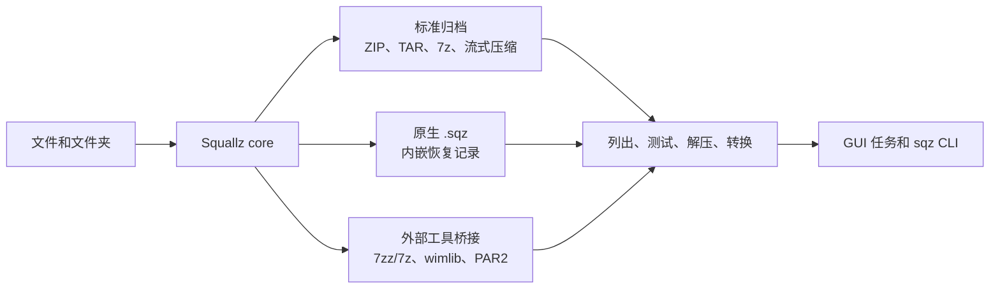
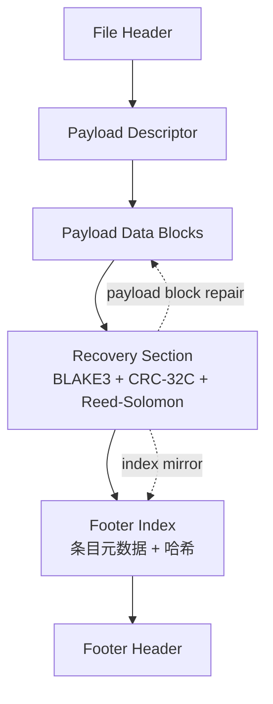
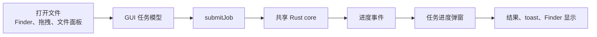

# Squallz

<p align="center">
  
</p>

<p align="center">
  一个带原生自恢复容器的桌面压缩工具和 CLI。
</p>

<p align="center">
  <a href="README.md">English README</a> |
  <a href="docs/format-support.md">格式支持</a> |
  <a href="docs/sqz-container-format-v1.md">SQZ 规范</a> |
  <a href="docs/privacy.md">隐私说明</a>
</p>

Squallz 是 Rust 优先的压缩归档工具，提供两个入口：Tauri/Svelte 桌面应用和
可脚本化的 `sqz` CLI。归档业务逻辑集中在共享的 Rust core、formats 和 recovery
crate 中，GUI 与 CLI 尽量复用同一套能力，而不是各自实现一遍。

项目当前处于打磨和收尾阶段。目标是把已有能力做扎实：清楚的交互、可靠的归档处理、
本地隐私边界，以及可审计的 `.sqz` 自恢复容器。

## 一眼看懂



| 模块 | 能力 |
| --- | --- |
| 桌面应用 | Tauri 桌面 UI，支持共享任务进度、主题设置、历史记录、密码保存、拖拽和平台入口交接。 |
| CLI | `sqz` 支持创建、解压、列出、测试、转换、嵌套归档、checksum、重复文件扫描、批处理、诊断和 JSON 输出。 |
| 原生容器 | `.sqz` 包含条目目录、校验和、内嵌 Reed-Solomon 恢复、分卷以及标准归档导出。 |
| 安全边界 | 集中处理路径穿越、Zip Slip、符号链接越界、输出大小、条目数量和压缩比限制。 |
| 隐私 | 无广告、无遥测、不上传文件。只有用户主动选择记住密码时，才写入系统密码库。 |

## 格式边界

Squallz 会明确区分内置能力、外部工具能力和不支持的能力。

| 能力 | 当前边界 |
| --- | --- |
| 内置归档能力 | ZIP/ZIP64、TAR、7z，以及 gzip、bzip2、xz、zstd、lz4、brotli 等单文件流式压缩。 |
| 原生 `.sqz` | 支持创建、列出、测试、解压、能力范围内修复、分卷和导出为标准归档。 |
| WIM | 通过外部工具路径实现创建/读取，主要依赖可用的 `wimlib-imagex` 和 7zz/7z；默认不随包内置。 |
| 长尾只读格式 | 安装 7zz/7z 后，可通过桥接读取 APFS、AR、ARJ、CAB、CHM、CPIO、CramFS、DMG、EXT、FAT、GPT、HFS、IHEX、ISO、LZH、LZMA、MBR、MSI、NSIS、NTFS、QCOW2、RPM、SquashFS、UDF、UEFI、VDI、VHD、VHDX、VMDK、XAR、Z 等格式。 |
| RAR | 只读桥接。Squallz 不创建 RAR，不实现 RAR recovery record，也不承诺修复损坏 RAR。 |
| 外置恢复 | PAR2 verify/repair 有 Rust fallback 和可选外部桥接；PAR2 create 在本机存在标准外部工具时可用。 |

可以随时查看当前机器上的实际能力：

```sh
sqz info --json
sqz doctor --json
sqz doctor --strict
```

## 为什么要有 `.sqz`

`.sqz` 是 Squallz 的原生恢复容器。它面向长期保存和损坏恢复场景，但不走封闭格式，
也不冒充 RAR recovery record。



当前 `.sqz` 重点能力：

- 支持条目集合容器，以及 `zip`、`tar`、`7z`、`zstd` 内部 profile。
- 对 payload block 写入内嵌 Reed-Solomon 恢复数据。
- Footer Index 镜像可在部分目录损坏场景中恢复条目元数据。
- `RSPC` 保护层用于保护 Recovery Section 自身。
- `.sqz.001/.002/...` 分卷带 `SQZV` 小头。
- `.sqz.rev001/.rev002/.rev003` 为分卷 parity sidecar，有明确恢复上限。
- 可通过共享 engine 导出到 ZIP、7z、TAR、TAR.ZST 等标准格式。

完整二进制结构和损坏边界见
[docs/sqz-container-format-v1.md](docs/sqz-container-format-v1.md)。

## CLI 示例

创建并检查标准压缩包：

```sh
sqz compress ./Photos -o Photos.zip --profile balanced
sqz list Photos.zip --tree
sqz test Photos.zip --json
sqz extract Photos.zip -d ./Restored --smart
```

创建自恢复 `.sqz` 容器：

```sh
sqz pack ./Project -o Project.sqz --recovery 25% --inner-format zstd
sqz test Project.sqz --json
sqz repair Project.sqz -o Project.repaired.sqz --json
sqz export Project.repaired.sqz -o Project.zip
```

处理安全限制、乱码和自动化：

```sh
sqz extract legacy.zip -d out --encoding gbk --max-output-bytes 2g
sqz checksum ./release -a blake3
sqz checksum --check SHA256SUMS
sqz duplicates ./Downloads --min-size 1m --json
sqz batch jobs.json --keep-going --json
```

不手动落盘解压，直接转换：

```sh
sqz convert source.zip -o source.7z --profile maximum
sqz export archive.sqz -o archive.tar.zst
```

## 桌面应用



GUI 是基于 Tauri 的桌面应用，归档逻辑与 CLI 共享。它聚焦于少量高频桌面流程：

- 打开压缩包、浏览条目、预览支持的文件并安全解压。
- 通过共享任务执行压缩、转换、测试、checksum、修复和导出。
- 支持明暗主题、accent 颜色、reduced-motion、英文/中文内置文案。
- 只有用户显式选择记住密码时，才通过系统密码库保存归档密码。
- 安装或生成平台文件管理器入口时，不静默抢占默认打开方式。

当前 macOS Finder Quick Actions 是已打包应用的主要平台入口。Windows Explorer 和 Linux
文件管理器资产属于生成/文档化边界，具体发布限制见
[docs/platform-integration.md](docs/platform-integration.md)。

## 构建与开发

前置条件：

- Rust toolchain 和 Cargo。
- Node.js 与 npm，用于 Svelte/Tauri 前端。
- 构建桌面应用时，需要对应平台的 Tauri 依赖。
- 可选外部工具：`7zz`/`7z`、`wimlib-imagex`、标准 `par2` 工具。

安装前端依赖：

```sh
make install
```

构建和测试核心路径：

```sh
cargo build --workspace
cargo test --all
```

开发模式运行桌面应用：

```sh
make dev
```

为当前平台打包：

```sh
make app-release
```

## 未签名的 GitHub Release 二进制

这一节只适用于从 GitHub Releases 下载 Squallz 预编译二进制的用户，不适用于从源码运行，
也不适用于后续通过包管理器安装的版本。当前早期桌面二进制还没有做代码签名和公证。
归档处理和 CLI 行为不受影响，但操作系统可能在应用启动前拦截，或在安装文件管理器入口时提示风险。

只有在你自己构建了该应用，或确认下载来源可信时，才绕过这些系统提示。如果下载页面同时提供
checksum，请先比对后再绕过操作系统警告。如果你不确定二进制来自哪里，删除它并改为从源码构建。

由 GitHub Actions 发布流程生成的下载文件会附带逐文件 `.sha256`、`.provenance.json`
证据文件，以及 GitHub Artifact Attestations。从 GitHub Releases 下载文件后，先验证
checksum 和构建来源，再处理操作系统拦截：

```sh
shasum -a 256 /path/to/downloaded-asset
gh attestation verify /path/to/downloaded-asset --repo yangzhg/Squallz
```

把命令输出的 SHA-256 值和对应的 `.sha256` 文件进行比对。

### macOS

如果 Finder 提示无法验证开发者，或提示 Apple 无法检查这个应用是否包含恶意软件：

1. 先确认下载来自预期的发布页；如果发布页提供 checksum，先完成比对。
2. 如果你准备长期使用，把 `Squallz.app` 移到“应用程序”目录。
3. 按住 Control 或右键点击 `Squallz.app`，选择“打开”，再确认“打开”。
4. 如果 macOS 仍然拦截，打开“系统设置 → 隐私与安全性”，找到 Squallz 后选择“仍要打开”。

如果确认来源可信后，macOS 仍提示应用已损坏、无法打开，通常是 unsigned bundle 上的
quarantine 属性导致的。移除该属性后再重新打开：

```sh
xattr -dr com.apple.quarantine /path/to/Squallz.app
```

如果下载的 `sqz` CLI 二进制被拦截或没有执行权限，先确认来源可信，再执行：

```sh
xattr -d com.apple.quarantine /path/to/sqz
chmod +x /path/to/sqz
```

### Windows

如果 Microsoft Defender SmartScreen 提示“Windows 已保护你的电脑”：

1. 先确认下载来自预期的发布页；如果发布页提供 checksum，先完成比对。
2. 选择“更多信息 → 仍要运行”。

如果 Microsoft Defender 或其他安全工具隔离了文件，只有在你确认来源和 checksum 可信后，
才恢复或允许该文件。如果无法验证这个二进制，删除它并改为从源码构建 Squallz。

### Linux

如果终端提示 `Permission denied`，或下载的 AppImage/二进制无法启动，先给它执行权限：

```sh
chmod +x /path/to/Squallz
chmod +x /path/to/sqz
```

如果桌面环境询问是否信任或集成下载的应用，请只在确认来源和 checksum 可信后同意。
如果包管理器或沙箱策略拦截应用，建议从源码构建，或改用当前发行版的原生包格式。

后续正式分发构建应使用签名和公证产物。在此之前，请把下载到的未签名二进制视为预览版构建。

常用校验：

```sh
cargo fmt --all -- --check
cargo clippy --all-targets --all-features -- -D warnings
cargo test --all
npm --prefix frontend run check
npm --prefix frontend run build
```

## 仓库结构

| 路径 | 作用 |
| --- | --- |
| `crates/squallz-core` | 共享归档流程、输入收集、过滤、任务队列、分卷、checksum 和安全限制。 |
| `crates/squallz-formats` | 归档格式实现和外部工具桥接。 |
| `crates/squallz-format-api` | 格式 trait、条目模型、解压契约、安全 helper 和 registry 类型。 |
| `crates/squallz-recovery` | 恢复校验和修复支持。 |
| `crates/squallz-cli` | `sqz` 命令行入口。 |
| `crates/squallz-gui` | Tauri 后端、桌面集成、任务、设置、密码和 IPC。 |
| `frontend` | Svelte UI、design token、任务弹窗、i18n 和前端状态。 |
| `locales` | 内置英文和中文语言包。 |
| `docs` | 格式、隐私、平台、许可证、帮助和发布边界文档。 |
| `scripts` | smoke、平台检查、发布 gate 和 UI 审计脚本。 |

## 隐私与信任

Squallz 按本地优先方式设计：

- 无遥测、无广告。
- 不上传压缩包内容、文件名、路径、密码、恢复数据或操作历史。
- 不把明文密码写入设置、localStorage、日志、普通任务历史或诊断报告。
- 使用外部工具时，只在本机进程中处理用户指定的本地文件。

完整说明见 [docs/privacy.md](docs/privacy.md)。

## 非目标

- 不创建 RAR。
- 不声明兼容 RAR recovery record 或 RAR `.rev`。
- 不静默抢占默认压缩包打开方式。
- 不引入专利或分发边界不清楚的专有编码器。
- 不把 `.sqz`、ZIP rebuild 或 PAR2 证据之外的场景包装成“可修复”。

## 许可证

Squallz 项目本体按 [MIT 许可证](LICENSE-MIT) 或
[Apache License 2.0](LICENSE-APACHE) 双许可发布，使用者可二选一。依赖和外部工具
许可证台账见 [docs/licenses.md](docs/licenses.md)。
