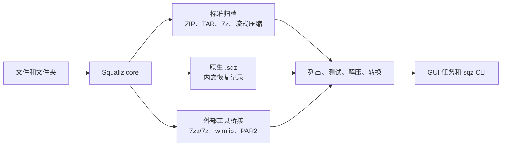
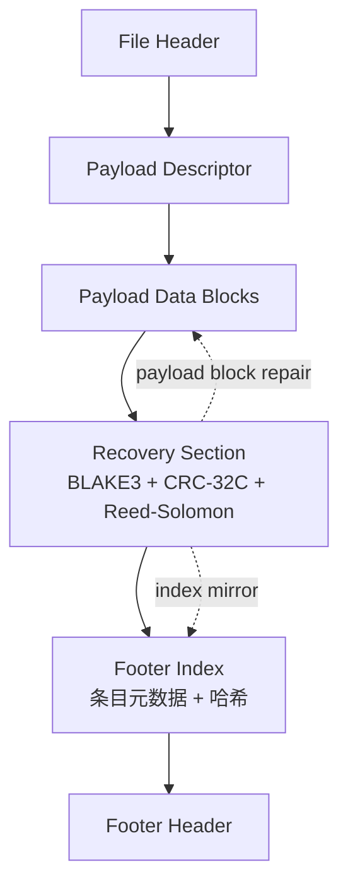
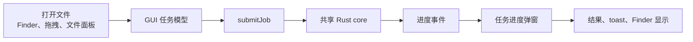

# Squallz

<p align="center">
  
</p>

<p align="center">
  一个带原生自恢复容器的桌面压缩工具和 CLI。
</p>

<p align="center">
  <a href="README.md">English README</a> |
  <a href="docs/format-support.md">格式支持</a> |
  <a href="docs/sqz-container-format-v1.md">SQZ 规范</a> |
  <a href="docs/SELF_EXTRACTING.md">SFX 规范</a> |
  <a href="docs/macos-release.md">macOS 发布</a> |
  <a href="docs/privacy.md">隐私说明</a>
</p>

Squallz 是 Rust 优先的压缩归档工具，提供两个入口：Tauri/Svelte 桌面应用和
可脚本化的 `sqz` CLI。归档业务逻辑集中在共享的 Rust core、formats 和 recovery
crate 中，GUI 与 CLI 尽量复用同一套能力，而不是各自实现一遍。

项目当前处于打磨和收尾阶段。目标是把已有能力做扎实：清楚的交互、可靠的归档处理、
本地隐私边界，以及可审计的 `.sqz` 自恢复容器。

## 一眼看懂


```mermaid
flowchart LR
  A["文件和文件夹"] --> B["Squallz core"]
  B --> C["标准归档<br/>ZIP、TAR、7z、流式压缩"]
  B --> D["原生 .sqz<br/>内嵌恢复记录"]
  B --> E["外部工具桥接<br/>7zz/7z、wimlib、PAR2"]
  C --> F["列出、测试、解压、转换"]
  D --> F
  E --> F
  F --> G["GUI 任务和 sqz CLI"]
```

| 模块 | 能力 |
| --- | --- |
| 桌面应用 | Tauri 桌面 UI，支持共享任务进度、主题设置、历史记录、密码保存、拖拽和平台入口交接。 |
| CLI | `sqz` 支持创建压缩包和 SFX、解压、列出、测试、转换、嵌套归档、checksum、重复文件扫描、批处理、诊断和 JSON 输出。 |
| 原生容器 | `.sqz` 包含条目目录、校验和、内嵌 Reed-Solomon 恢复、分卷以及标准归档导出。 |
| 安全边界 | 集中处理路径穿越、Zip Slip、符号链接越界、输出大小、条目数量和压缩比限制。 |
| 隐私 | 无广告、无遥测、不上传文件。只有用户主动选择记住密码时，才写入系统密码库。 |

## 格式边界

Squallz 会明确区分内置能力、外部工具能力和不支持的能力。

| 能力 | 当前边界 |
| --- | --- |
| 内置归档能力 | ZIP/ZIP64、TAR、7z，以及 gzip、bzip2、xz、zstd、lz4、brotli 等单文件流式压缩。 |
| 原生 `.sqz` | 支持创建、列出、测试、解压、能力范围内修复、分卷和导出为标准归档。 |
| WIM | 通过外部工具路径实现创建/读取，主要依赖可用的 `wimlib-imagex` 和 7zz/7z；默认不随包内置。 |
| 长尾只读格式 | 安装 7zz/7z 后，可通过桥接读取 APFS、AR、ARJ、CAB、CHM、CPIO、CramFS、DMG、EXT、FAT、GPT、HFS、IHEX、ISO、LZH、LZMA、MBR、MSI、NSIS、NTFS、QCOW2、RPM、SquashFS、UDF、UEFI、VDI、VHD、VHDX、VMDK、XAR、Z 等格式。 |
| RAR | 只读桥接。Squallz 不创建 RAR，不实现 RAR recovery record，也不承诺修复损坏 RAR。 |
| 自解压文件 | SFX v1 可把完整 ZIP 载荷与 Squallz Windows PE、Linux ELF stub 或 macOS GUI `.app` 模板组装为目标平台产物。CLI 与桌面创建页支持当前主机目标，完成后再签名。 |
| 外置恢复 | PAR2 verify/repair 有 Rust fallback 和可选外部桥接；PAR2 create 在本机存在标准外部工具时可用。 |

可以随时查看当前机器上的实际能力：

```sh
sqz info --json
sqz doctor --json
sqz doctor --strict
```

## 为什么要有 `.sqz`

`.sqz` 是 Squallz 的原生恢复容器。它面向长期保存和损坏恢复场景，但不走封闭格式，
也不冒充 RAR recovery record。


```mermaid
flowchart TB
  H["File Header"] --> P["Payload Descriptor"]
  P --> D["Payload Data Blocks"]
  D --> R["Recovery Section<br/>BLAKE3 + CRC-32C + Reed-Solomon"]
  R --> I["Footer Index<br/>条目元数据 + 哈希"]
  I --> F["Footer Header"]
  R -. "index mirror" .-> I
  R -. "payload block repair" .-> D
```

当前 `.sqz` 重点能力：

- 支持条目集合容器，以及 `zip`、`tar`、`7z`、`zstd` 内部 profile。
- 对 payload block 写入内嵌 Reed-Solomon 恢复数据。
- Footer Index 镜像可在部分目录损坏场景中恢复条目元数据。
- `RSPC` 保护层用于保护 Recovery Section 自身。
- `.sqz.001/.002/...` 分卷带 `SQZV` 小头。
- `.sqz.rev001/.rev002/.rev003` 为分卷 parity sidecar，有明确恢复上限。
- 可通过共享 engine 导出到 ZIP、7z、TAR、TAR.ZST 等标准格式。

完整二进制结构和损坏边界见
[docs/sqz-container-format-v1.md](docs/sqz-container-format-v1.md)。

## CLI 示例

创建并检查标准压缩包：

```sh
sqz compress ./Photos -o Photos.zip --profile balanced
sqz list Photos.zip --tree
sqz test Photos.zip --json
sqz extract Photos.zip -d ./Restored --smart
```

用完整 ZIP 载荷创建并校验 Windows 或 Linux 自解压文件：

```sh
sqz sfx create Photos.zip --target windows --stub sqz.exe -o Photos.exe
sqz sfx create Photos.zip --target macos --stub Squallz.app -o Photos.app
sqz sfx inspect Photos.exe
```

运行时只提供列出、测试和安全解压，不会自动执行压缩包内的代码。产物组装完成后再做最终签名。布局和 macOS 签名边界见
[docs/SELF_EXTRACTING.md](docs/SELF_EXTRACTING.md)。

创建自恢复 `.sqz` 容器：

```sh
sqz pack ./Project -o Project.sqz --recovery 25% --inner-format zstd
sqz test Project.sqz --json
sqz repair Project.sqz -o Project.repaired.sqz --json
sqz export Project.repaired.sqz -o Project.zip
```

处理安全限制、乱码和自动化：

```sh
sqz extract legacy.zip -d out --encoding gbk --max-output-bytes 2g
sqz checksum ./release -a blake3
sqz checksum --check SHA256SUMS
sqz duplicates ./Downloads --min-size 1m --json
sqz batch jobs.json --keep-going --json
```

查看已安装的 CLI 版本，或检查稳定版发布通道：

```sh
sqz --version
sqz check-update
sqz check-update --json
```

`sqz --version` 只读取本地版本，不会联网。`sqz check-update` 只读取稳定版发布元数据，
不会下载或安装更新软件包。`up_to_date`、`update_available` 和 `ahead` 都属于正常结果并以 0
退出；发现新版本但当前平台没有适配包时也仍然以 0 退出。它与 `sqz update` 不同，后者
用于添加、删除、重命名或移动已有压缩包中的条目。

不手动落盘解压，直接转换：

```sh
sqz convert source.zip -o source.7z --profile maximum
sqz convert source.zip -o source.7z --profile balanced --split 700m
sqz export archive.sqz -o archive.tar.zst
```

转换和导出默认拒绝已有输出。分卷转换会发布 `.001/.002/...` 并报告每一个分卷。
只有明确决定替换文件或完整编号集合时，才使用 `--force`。

## 桌面应用


```mermaid
flowchart LR
  A["打开文件<br/>Finder、拖拽、文件面板"] --> B["GUI 任务模型"]
  B --> C["submitJob"]
  C --> D["共享 Rust core"]
  D --> E["进度事件"]
  E --> F["任务进度弹窗"]
  F --> G["结果、toast、Finder 显示"]
```

GUI 是基于 Tauri 的桌面应用，归档逻辑与 CLI 共享。它聚焦于少量高频桌面流程：

- 打开压缩包、浏览条目、预览支持的文件并安全解压。
- 通过共享任务执行压缩、转换、测试、checksum、修复和导出。
- 支持明暗主题、accent 颜色、reduced-motion、英文/中文内置文案。
- 只有用户显式选择记住密码时，才通过系统密码库保存归档密码。
- 安装或生成平台文件管理器入口时，不静默抢占默认打开方式。

当前 macOS Finder Quick Actions 是已打包应用的主要平台入口。Windows Explorer 和 Linux
文件管理器资产属于生成/文档化边界，具体发布限制见
[docs/platform-integration.md](docs/platform-integration.md)。

## 构建与开发

前置条件：

- Rust toolchain 和 Cargo。
- Node.js 与 npm，用于 Svelte/Tauri 前端。
- 构建桌面应用时，需要对应平台的 Tauri 依赖。
- 可选外部工具：`7zz`/`7z`、`wimlib-imagex`、标准 `par2` 工具。

安装前端依赖：

```sh
make install
```

构建和测试核心路径：

```sh
cargo build --workspace
cargo test --all
```

开发模式运行桌面应用：

```sh
make dev
```

为当前平台打包：

```sh
make app-release
```

## 发布产物的信任状态

GitHub Release 中的每个文件都有独立的信任状态，不能把同一批附件笼统理解为“全部已签名”：

| 状态 | 含义 |
| --- | --- |
| `developer-id-notarized` | macOS DMG 已通过 Developer ID 签名、Apple 公证、staple、Gatekeeper 和最终哈希检查。 |
| `unsigned-preview` | 不声明平台签名或公证证据；当前 Windows 和 Linux 包使用这一状态。 |
| `source` | 源码归档，不适用桌面代码签名。 |

公开 macOS 流程只有在完整信任链通过后才会发布 DMG，不会降级上传未签名的 macOS 包。没有标注
信任状态的旧版本应按未签名预览版处理。

每个主要附件都有同名 `.sha256`、`.provenance.json` 和 GitHub Artifact Attestation；
`developer-id-notarized` DMG 还会带同名 `.trust.json`。运行下载文件前先核对这些证据：

```sh
shasum -a 256 /path/to/downloaded-asset
gh attestation verify /path/to/downloaded-asset --repo yangzhg/Squallz
```

把命令输出的 SHA-256 值和对应的 `.sha256` 文件进行比对。维护者使用的完整 macOS 流程见
[docs/macos-release.md](docs/macos-release.md)。

### macOS

对标记为 `developer-id-notarized` 的 DMG，再检查 Apple ticket 和 Gatekeeper：

```sh
xcrun stapler validate /path/to/Squallz.dmg
spctl --assess --type open --context context:primary-signature --verbose=4 /path/to/Squallz.dmg
```

如果任一命令失败，或系统拦截了标记为 `developer-id-notarized` 的 DMG，应停止安装并反馈发布问题。
不要对“发布声明”和系统检查结果不一致的包移除 quarantine，也不要选择“仍要打开”。

未签名预览版即使 checksum 正确也可能被系统拦截。只有在自己构建，或已经核对来源和 provenance
时才绕过提示：先右键或按住 Control 打开应用；确有需要时，再到“隐私与安全性”选择“仍要打开”。
移除 quarantine 只作为已验证预览版的最后手段：

```sh
xattr -dr com.apple.quarantine /path/to/Squallz.app
```

已验证的预览版 CLI 如果没有执行权限，可以运行：

```sh
xattr -d com.apple.quarantine /path/to/sqz
chmod +x /path/to/sqz
```

### Windows 和 Linux 预览版

当前 Windows 和 Linux 下载标记为 `unsigned-preview`。Windows 出现 SmartScreen 警告时，先核对
checksum 和 provenance，再选择“更多信息 → 仍要运行”。如果无法验证来源，不要恢复被安全软件
隔离的文件。

Linux 上已验证的 AppImage 或二进制可能需要补执行权限：

```sh
chmod +x /path/to/Squallz
chmod +x /path/to/sqz
```

无法验证未签名预览版时，请删除它并从源码构建。

常用校验：

```sh
cargo fmt --all -- --check
cargo clippy --all-targets --all-features -- -D warnings
cargo test --all
make test-release-tools
npm --prefix frontend run check
npm --prefix frontend run build
```

## 仓库结构

| 路径 | 作用 |
| --- | --- |
| `crates/squallz-core` | 共享归档流程、输入收集、过滤、任务队列、分卷、checksum 和安全限制。 |
| `crates/squallz-formats` | 归档格式实现和外部工具桥接。 |
| `crates/squallz-format-api` | 格式 trait、条目模型、解压契约、安全 helper 和 registry 类型。 |
| `crates/squallz-recovery` | 恢复校验和修复支持。 |
| `crates/squallz-update` | GUI 和 CLI 共用的稳定版发现逻辑，不包含下载或安装路径。 |
| `crates/squallz-cli` | `sqz` 命令行入口。 |
| `crates/squallz-gui` | Tauri 后端、桌面集成、任务、设置、密码和 IPC。 |
| `frontend` | Svelte UI、design token、任务弹窗、i18n 和前端状态。 |
| `locales` | 内置英文和中文语言包。 |
| `docs` | 格式、隐私、平台、许可证、帮助和发布边界文档。 |
| `scripts` | smoke、平台检查、发布 gate 和 UI 审计脚本。 |

## 隐私与信任

Squallz 按本地优先方式设计：

- 无遥测、无广告。
- 不上传压缩包内容、文件名、路径、密码、恢复数据或操作历史。
- 不把明文密码写入设置、localStorage、日志、普通任务历史或诊断报告。
- 使用外部工具时，只在本机进程中处理用户指定的本地文件。

完整说明见 [docs/privacy.md](docs/privacy.md)。

## 非目标

- 不创建 RAR。
- 不声明兼容 RAR recovery record 或 RAR `.rev`。
- 不静默抢占默认压缩包打开方式。
- 不引入专利或分发边界不清楚的专有编码器。
- 不把 `.sqz`、ZIP rebuild 或 PAR2 证据之外的场景包装成“可修复”。

## 许可证

Squallz 项目本体按 [MIT 许可证](LICENSE-MIT) 或
[Apache License 2.0](LICENSE-APACHE) 双许可发布，使用者可二选一。依赖和外部工具
许可证台账见 [docs/licenses.md](docs/licenses.md)。
