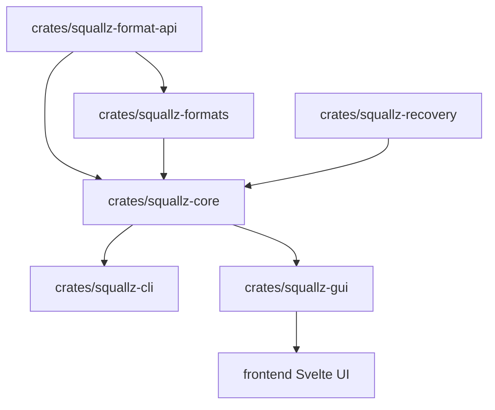

# Build and Development / 构建与开发

## English

Squallz is organized around shared archive logic and thin product surfaces.



## Repository Map

| Path | Purpose |
| --- | --- |
| `crates/squallz-core` | Shared archive workflows, input collection, filters, queues, volume handling, checksums, and safety limits. |
| `crates/squallz-formats` | Archive format implementations and external bridges. |
| `crates/squallz-format-api` | Format traits, entries, extraction contracts, safety helpers, and registry types. |
| `crates/squallz-recovery` | Recovery verification and repair support. |
| `crates/squallz-cli` | `sqz` command-line interface. |
| `crates/squallz-gui` | Tauri backend, desktop integration, jobs, settings, secrets, and IPC. |
| `frontend` | Svelte UI, design tokens, task dialogs, i18n, and frontend state. |
| `locales` | Built-in English and Chinese language packs. |
| `docs` | Format, privacy, platform, license, help, and release-boundary documentation. |
| `scripts` | Smoke tests, platform checks, release readiness, and UI audits. |

## Verification Commands

```sh
cargo fmt --all -- --check
cargo clippy --all-targets --all-features -- -D warnings
cargo test --all
npm --prefix frontend run check
npm --prefix frontend run build
```

## Development Rules

- Archive business logic belongs in Rust core, formats, and recovery crates.
- GUI and CLI should use shared capabilities instead of reimplementing archive behavior.
- User-visible GUI text belongs in `locales/en-US.json` and `locales/zh-CN.json`.
- Frontend visual rules should go through classes and design tokens in `frontend/src/design.css`.
- Public API, CLI, and container-format changes should preserve compatibility or document the break.

## 中文

Squallz 围绕共享归档逻辑和薄入口层组织。

## 仓库结构

| 路径 | 作用 |
| --- | --- |
| `crates/squallz-core` | 共享归档流程、输入收集、过滤、任务队列、分卷、checksum 和安全限制。 |
| `crates/squallz-formats` | 归档格式实现和外部工具桥接。 |
| `crates/squallz-format-api` | 格式 trait、条目模型、解压契约、安全 helper 和 registry 类型。 |
| `crates/squallz-recovery` | 恢复校验和修复支持。 |
| `crates/squallz-cli` | `sqz` 命令行入口。 |
| `crates/squallz-gui` | Tauri 后端、桌面集成、任务、设置、密码和 IPC。 |
| `frontend` | Svelte UI、design token、任务弹窗、i18n 和前端状态。 |
| `locales` | 内置英文和中文语言包。 |
| `docs` | 格式、隐私、平台、许可证、帮助和发布边界文档。 |
| `scripts` | smoke、平台检查、发布 gate 和 UI 审计脚本。 |

## 校验命令

```sh
cargo fmt --all -- --check
cargo clippy --all-targets --all-features -- -D warnings
cargo test --all
npm --prefix frontend run check
npm --prefix frontend run build
```

## 开发规则

- 归档业务逻辑属于 Rust core、formats 和 recovery crate。
- GUI 和 CLI 应复用共享能力，不重复实现归档行为。
- GUI 用户可见文案属于 `locales/en-US.json` 和 `locales/zh-CN.json`。
- 前端视觉规则应通过 class 和 `frontend/src/design.css` 的 design token 管理。
- 公共 API、CLI 和容器格式变更应保持兼容；破坏性变化需要先记录。
