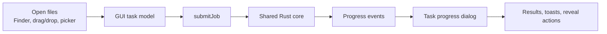

# Desktop App / 桌面应用

## English

The desktop app is a Tauri shell around the same shared archive engine used by the CLI. GUI-only features stay in the desktop layer: themes, windows, Finder handoff, drag and drop, saved passwords, and platform integration.

## Core Workflows

| Workflow | What happens |
| --- | --- |
| Open and browse | Open archives, inspect entries, preview supported files, and choose safe extraction targets. |
| Compress | Select files or folders, choose an output profile, and run the shared compression job. |
| Extract | Extract safely with traversal, symlink, resource, overwrite, and encoding guardrails. |
| Test | Verify archive integrity and surface actionable failures. |
| Convert and export | Convert standard archives or export `.sqz` into standard formats through shared engines. |
| Checksum | Compute and verify checksums without uploading file data. |
| Repair | Repair supported `.sqz`, ZIP rebuild, or PAR2-backed cases within documented recovery limits. |

## Desktop Boundaries

- macOS Finder Quick Actions are the active packaged integration path.
- Windows Explorer and Linux file-manager assets are generated and documented, but still have platform-specific release boundaries.
- Squallz does not silently take over default archive ownership.
- Saved passwords go through the OS credential store only after explicit user action.

## 中文

桌面应用是 Tauri 外壳，归档能力复用 CLI 使用的共享引擎。GUI-only 能力保留在桌面层，例如主题、窗口、Finder 入口、拖拽、密码保存和平台集成。

## 核心流程

| 流程 | 行为 |
| --- | --- |
| 打开和浏览 | 打开压缩包、查看条目、预览支持的文件，并选择安全的解压位置。 |
| 压缩 | 选择文件或文件夹，选择输出 profile，然后执行共享压缩任务。 |
| 解压 | 使用路径穿越、符号链接、资源限制、覆盖策略和编码保护安全解压。 |
| 测试 | 校验压缩包完整性，并显示可操作的失败信息。 |
| 转换和导出 | 通过共享 engine 转换标准归档，或把 `.sqz` 导出为标准格式。 |
| Checksum | 本地计算和验证 checksum，不上传文件数据。 |
| 修复 | 在文档化恢复能力内修复 `.sqz`、ZIP rebuild 或 PAR2 支持的场景。 |

## 桌面边界

- macOS Finder Quick Actions 是当前已打包应用的主要平台入口。
- Windows Explorer 和 Linux 文件管理器资产属于生成/文档化边界，还需要对应平台发布验收。
- Squallz 不静默抢占默认压缩包打开方式。
- 只有用户显式选择保存时，密码才写入系统密码库。
