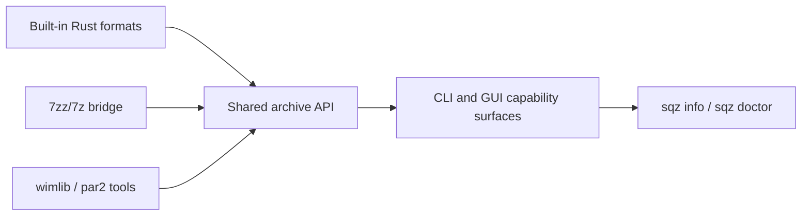

# Format Support / 格式支持

## English

Squallz separates built-in capabilities, external-tool bridge capabilities, and unsupported claims. The current machine's real capability can always be inspected with:

```sh
sqz info --json
sqz doctor --json
sqz doctor --strict
```

## Capability Map

| Capability | Boundary |
| --- | --- |
| Built-in archive work | ZIP/ZIP64, TAR, 7z, and single-stream compressors such as gzip, bzip2, xz, zstd, lz4, and brotli. |
| Native `.sqz` | Create, list, test, extract, repair within recovery limits, split volumes, and export to standard archives. |
| WIM | Create/read paths use external tooling, mainly `wimlib-imagex` and 7zz/7z where available. Not bundled by default. |
| Long-tail unpack-only formats | APFS, AR, ARJ, CAB, CHM, CPIO, CramFS, DMG, EXT, FAT, GPT, HFS, IHEX, ISO, LZH, LZMA, MBR, MSI, NSIS, NTFS, QCOW2, RPM, SquashFS, UDF, UEFI, VDI, VHD, VHDX, VMDK, XAR, and Z through the 7zz/7z bridge when installed. |
| RAR | Read-only bridge path. Squallz does not create RAR, does not implement RAR recovery records, and does not claim damaged RAR repair. |
| External recovery | PAR2 verify/repair has a Rust fallback and optional external bridge. PAR2 create uses an external standard tool when present. |



Full contract: [docs/format-support.md](https://github.com/yangzhg/Squallz/blob/main/docs/format-support.md)

## 中文

Squallz 明确区分内置能力、外部工具桥接能力和不支持的能力。当前机器的真实能力可以随时查看：

```sh
sqz info --json
sqz doctor --json
sqz doctor --strict
```

## 能力地图

| 能力 | 边界 |
| --- | --- |
| 内置归档能力 | ZIP/ZIP64、TAR、7z，以及 gzip、bzip2、xz、zstd、lz4、brotli 等单文件流式压缩。 |
| 原生 `.sqz` | 支持创建、列出、测试、解压、能力范围内修复、分卷和导出为标准归档。 |
| WIM | 创建/读取通过外部工具路径实现，主要依赖可用的 `wimlib-imagex` 和 7zz/7z；默认不随包内置。 |
| 长尾只读格式 | 安装 7zz/7z 后，可通过桥接读取 APFS、AR、ARJ、CAB、CHM、CPIO、CramFS、DMG、EXT、FAT、GPT、HFS、IHEX、ISO、LZH、LZMA、MBR、MSI、NSIS、NTFS、QCOW2、RPM、SquashFS、UDF、UEFI、VDI、VHD、VHDX、VMDK、XAR、Z 等格式。 |
| RAR | 只读桥接。Squallz 不创建 RAR，不实现 RAR recovery record，也不承诺修复损坏 RAR。 |
| 外置恢复 | PAR2 verify/repair 有 Rust fallback 和可选外部桥接；PAR2 create 在本机存在标准外部工具时可用。 |

完整合同见：[docs/format-support.md](https://github.com/yangzhg/Squallz/blob/main/docs/format-support.md)
