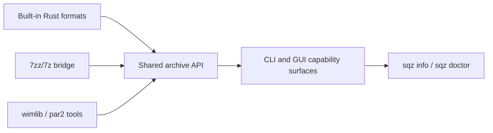

# Format Support / 格式支持

## English

Squallz separates built-in capabilities, external-tool bridge capabilities, and unsupported claims. The current machine's real capability can always be inspected with:

```sh
sqz info --json
sqz doctor --json
sqz doctor --strict
```

## Capability Map

| Capability | Boundary |
| --- | --- |
| Built-in archive work | ZIP/ZIP64, TAR, 7z, and single-stream compressors such as gzip, bzip2, xz, zstd, lz4, and brotli. |
| Native `.sqz` | Create, list, test, extract, repair within recovery limits, split volumes, and export to standard archives. |
| WIM | Standalone WIM/ESD create/read paths use external tooling, mainly `wimlib-imagex` and 7zz/7z where available. Native creation uses `wimlib-imagex split` and transactionally publishes the standard `.swm`, `2.swm`, … family with the first member primary; one indivisible resource may exceed the requested target size. A complete family can be opened from any standard member after GUID, part-count, exact-name, completeness, and stable-identity validation. Missing parts are named precisely. Not bundled by default. |
| Numbered volumes | Squallz `.001/.002/...` output is a contiguous 7-Zip-style byte split. Any present member can locate the set and known gaps name the missing volume. This remains distinct from native ZIP `.z01/.zip`, RAR-format volumes, and Split WIM. |
| Native ZIP volumes | Built-in creation and conversion can write PKWARE-compatible `.z01/.z02/…/.zip` sets, with the final `.zip` as the primary member. Existing sets can be opened from any member after ZIP disk metadata and the complete family are validated. Reading, including encrypted entries, uses private staging plus external 7zz/7z; passwords travel through stdin rather than process arguments or environment variables. |
| Long-tail unpack-only formats | APFS, AR, ARJ, CAB, CHM, CPIO, CramFS, DMG, EXT, FAT, GPT, HFS, IHEX, ISO, LZH, LZMA, MBR, MSI, NSIS, NTFS, QCOW2, RPM, SquashFS, UDF, UEFI, VDI, VHD, VHDX, VMDK, XAR, and Z through the 7zz/7z bridge when installed. |
| RAR | Read-only bridge when external 7zz/7z is installed; Squallz does not include a RAR decoder. RAR-format `partN.rar` and legacy `.rar/.r00`–`.r99` sets can open from any member through isolated first-volume staging. Passwords stay on the stdin-only 7zz/7z path. When 7zz/7z positively confirms an unencrypted RAR7 v6 archive, optional user-installed unrar can stream entries that 7zz 26.01 cannot decode; it is never used for encrypted or unknown-encryption input. Real macOS RAR5, old-style RAR4 including header encryption, and a two-volume unencrypted RAR7 v6 sample pass their scoped checks. Broader historical RAR4, encrypted/solid RAR7 coverage, and the full three-platform package matrix are not release-claimed. Squallz does not create RAR, implement recovery records, or repair damaged RAR. |
| External recovery | PAR2 verify/repair has a Rust fallback and optional external bridge. A single member can be repaired to a new no-replace file; split or multi-file sets can be repaired to a new folder containing only the exact described paths, with source files unchanged and repaired output checksum-verified before publication. PAR2 create uses an external standard tool when present. |


```mermaid
flowchart LR
  A["Built-in Rust formats"] --> D["Shared archive API"]
  B["7zz/7z bridge"] --> D
  C["wimlib / par2 tools"] --> D
  D --> E["CLI and GUI capability surfaces"]
  E --> F["sqz info / sqz doctor"]
```

Full contract: [docs/format-support.md](https://github.com/yangzhg/Squallz/blob/main/docs/format-support.md)

## 中文

Squallz 明确区分内置能力、外部工具桥接能力和不支持的能力。当前机器的真实能力可以随时查看：

```sh
sqz info --json
sqz doctor --json
sqz doctor --strict
```

## 能力地图

| 能力 | 边界 |
| --- | --- |
| 内置归档能力 | ZIP/ZIP64、TAR、7z，以及 gzip、bzip2、xz、zstd、lz4、brotli 等单文件流式压缩。 |
| 原生 `.sqz` | 支持创建、列出、测试、解压、能力范围内修复、分卷和导出为标准归档。 |
| WIM | 独立 WIM/ESD 的创建/读取通过外部工具路径实现，主要依赖可用的 `wimlib-imagex` 和 7zz/7z。原生创建调用 `wimlib-imagex split`，把标准 `.swm`、`2.swm`…卷组作为一个事务发布，并以第一卷为主入口；单个不可切分资源可能超过目标卷大小。完整卷组在校验 GUID、卷号、总卷数、标准命名、完整性和稳定文件身份后，可从任一标准成员打开；缺卷会精确指出文件名。默认不随包内置。 |
| 编号分卷 | Squallz 的 `.001/.002/...` 是与 7-Zip 相同的连续字节切分；任一现存卷都能定位卷集，已知缺口会指出缺失卷名。它仍与 ZIP 原生 `.z01/.zip`、RAR 格式多卷和 Split WIM 分开处理。 |
| ZIP 原生分卷 | 内置创建与转换可生成兼容 PKWARE 的 `.z01/.z02/…/.zip` 卷组，并把最后的 `.zip` 作为主入口。已有卷组在校验 ZIP 磁盘元数据和完整成员后，可从任意一卷进入。读取（包括加密条目）通过私有暂存和外部 7zz/7z 完成；密码只经标准输入传递，不进入进程参数或环境变量。 |
| 长尾只读格式 | 安装 7zz/7z 后，可通过桥接读取 APFS、AR、ARJ、CAB、CHM、CPIO、CramFS、DMG、EXT、FAT、GPT、HFS、IHEX、ISO、LZH、LZMA、MBR、MSI、NSIS、NTFS、QCOW2、RPM、SquashFS、UDF、UEFI、VDI、VHD、VHDX、VMDK、XAR、Z 等格式。 |
| RAR | 安装外部 7zz/7z 后可只读桥接；Squallz 不内置 RAR 解码器。RAR 格式的 `partN.rar` 与旧式 `.rar/.r00`–`.r99` 卷组可从任意卷进入，并在隔离暂存目录归一到首卷；密码始终留在只经标准输入传递的 7zz/7z 路径。当 7zz/7z 明确证明 RAR7 v6 归档未加密时，可选的用户自装 unrar 会负责 7zz 26.01 无法解码的条目流；加密状态未知或存在加密条目时绝不启用。macOS 上的真实 RAR5、旧式 RAR4（包括主头加密）以及一个未加密 RAR7 v6 两卷样本已通过各自范围内的检查；更早历史 RAR4、更广的加密/solid RAR7 样本与完整三平台矩阵仍不作为发布承诺。Squallz 不创建 RAR、不实现 recovery record，也不修复损坏 RAR。 |
| 外置恢复 | PAR2 verify/repair 有 Rust fallback 和可选外部桥接。单个成员可修复为不覆盖已有位置的新文件；分卷或多文件集可修复到全新文件夹，仅发布 PAR2 精确描述的路径，源文件保持不变，并在发布前重新校验修复结果。PAR2 create 在本机存在标准外部工具时可用。 |

完整合同见：[docs/format-support.md](https://github.com/yangzhg/Squallz/blob/main/docs/format-support.md)
