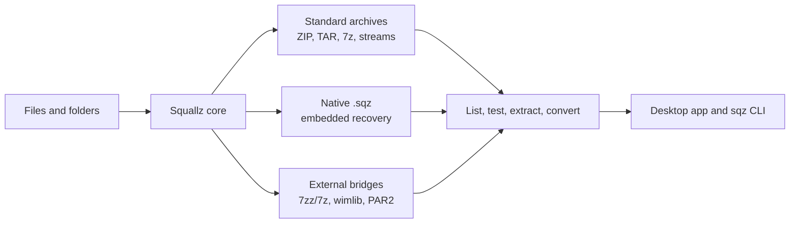

# Squallz Wiki

  

  Desktop and CLI archive manager with native <code>.sqz</code> self-recovery containers.

Last reviewed: 2026-07-01

## Overview

Squallz is a Rust-first archive tool with two product surfaces: a Tauri/Svelte desktop app and a scriptable `sqz` command line interface. Archive behavior lives in shared Rust core, format, and recovery crates, so GUI and CLI workflows stay aligned.

The project is in a polish and hardening phase. The goal is dependable archive workflows, clear local privacy boundaries, and a reliable `.sqz` container, not broad feature sprawl.

| Area | What it means |
| --- | --- |
| Desktop app | Tauri UI for opening, previewing, testing, extracting, compressing, converting, checksums, repair, themes, history, and desktop handoff paths. |
| CLI | `sqz` supports scriptable archive creation, extraction, listing, testing, conversion, nested archives, checksums, duplicate scans, batch jobs, diagnostics, and JSON output. |
| Native `.sqz` | Recovery-focused container with footer indexes, checksums, embedded Reed-Solomon recovery, split volumes, and standard archive export. |
| Safety | Shared extraction guardrails for path traversal, Zip Slip, symlink breakout, output limits, entry limits, and compression-ratio limits. |
| Privacy | No ads, no telemetry, no file uploads. Saved passwords use the OS credential store only when the user opts in. |

## 中文概览

Squallz 是 Rust 优先的压缩归档工具，提供两个入口：Tauri/Svelte 桌面应用和可脚本化的 `sqz` CLI。归档业务逻辑集中在共享 Rust core、formats 和 recovery crate 中，避免 GUI 和 CLI 各自实现一套行为。

项目当前处于打磨和收尾阶段。重点是可靠的归档流程、本地隐私边界和可审计的 `.sqz` 自恢复容器，而不是继续扩张功能面。

| 模块 | 含义 |
| --- | --- |
| 桌面应用 | 用 Tauri UI 完成打开、预览、测试、解压、压缩、转换、checksum、修复、主题、历史记录和桌面入口交接。 |
| CLI | `sqz` 支持创建、解压、列出、测试、转换、嵌套归档、checksum、重复文件扫描、批处理、诊断和 JSON 输出。 |
| 原生 `.sqz` | 面向恢复的容器，包含 footer index、校验和、内嵌 Reed-Solomon 恢复、分卷和标准归档导出。 |
| 安全边界 | 共享处理路径穿越、Zip Slip、符号链接越界、输出大小、条目数量和压缩比限制。 |
| 隐私 | 无广告、无遥测、不上传文件；只有用户主动选择记住密码时才写入系统密码库。 |

## Start Here

- [[Quick Start|Quick-Start]]
- [[Desktop App|Desktop-App]]
- [[CLI Guide|CLI-Guide]]
- [[SQZ Recovery Container|SQZ-Recovery-Container]]
- [[Format Support|Format-Support]]

## Repository Links

- [Source repository](https://github.com/yangzhg/Squallz)
- [English README](https://github.com/yangzhg/Squallz/blob/main/README.md)
- [中文 README](https://github.com/yangzhg/Squallz/blob/main/README.zh-CN.md)
- [Format support contract](https://github.com/yangzhg/Squallz/blob/main/docs/format-support.md)
- [SQZ container format v1](https://github.com/yangzhg/Squallz/blob/main/docs/sqz-container-format-v1.md)
- [Privacy policy](https://github.com/yangzhg/Squallz/blob/main/docs/privacy.md)
