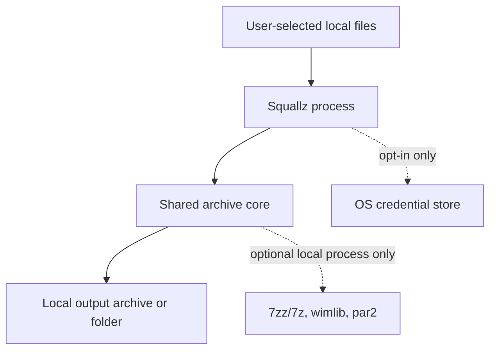

# Privacy and Safety / 隐私与安全

## English

Squallz is designed as a local-first archive tool.

## Privacy Commitments

- No ads, no bundled marketing payloads, and no telemetry.
- No upload of archive contents, file names, paths, passwords, recovery data, or operation history.
- No plaintext passwords in settings, localStorage, logs, normal task history, or diagnostic reports.
- External tools, when used, are invoked locally on user-selected files.
- Crash reporting is not automatically enabled in the current pre-release line.

## Extraction Safety

Shared core guardrails cover:

- path traversal and Zip Slip;
- symlink breakout;
- overwrite policy;
- output size limits;
- entry count limits;
- compression-ratio limits;
- dangerous or invalid output names;
- password and encoding handling without logging secrets.

Privacy policy: [docs/privacy.md](https://github.com/yangzhg/Squallz/blob/main/docs/privacy.md)

## 中文

Squallz 按本地优先方式设计。

## 隐私承诺

- 无广告、无捆绑营销内容、无遥测。
- 不上传压缩包内容、文件名、路径、密码、恢复数据或操作历史。
- 不把明文密码写入设置、localStorage、日志、普通任务历史或诊断报告。
- 使用外部工具时，只在本机进程中处理用户指定的本地文件。
- 当前首发开发线没有自动启用崩溃上报。

## 解压安全

共享 core guardrail 覆盖：

- 路径穿越和 Zip Slip；
- 符号链接越界；
- 覆盖策略；
- 输出大小限制；
- 条目数量限制；
- 压缩比限制；
- 危险或非法输出文件名；
- 密码与编码处理，且不把秘密写入日志。

隐私说明见：[docs/privacy.md](https://github.com/yangzhg/Squallz/blob/main/docs/privacy.md)
