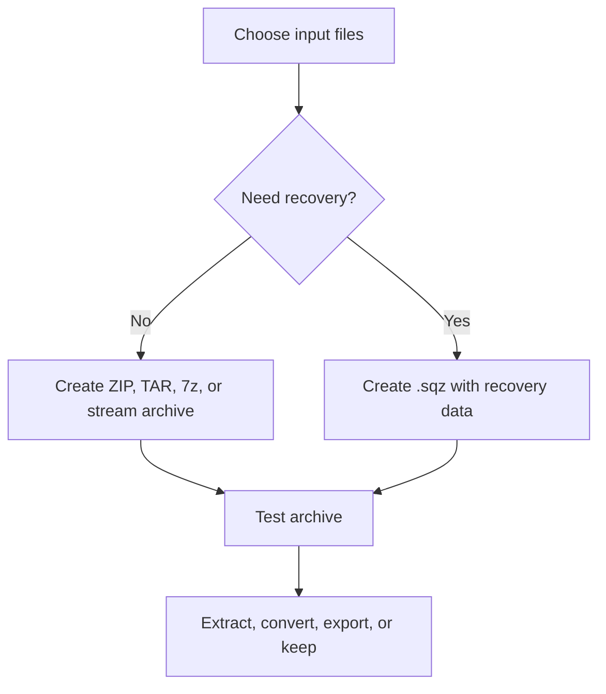

# Quick Start / 快速开始

## English

Use Squallz from the desktop app for interactive archive work, or use `sqz` when you need repeatable commands, CI jobs, or JSON output.



## Install From Source

Prerequisites:

- Rust toolchain with Cargo.
- Node.js and npm for the Svelte/Tauri frontend.
- Platform-specific Tauri requirements for desktop builds.
- Optional external tools for bridge-backed formats: `7zz`/`7z`, `wimlib-imagex`, and a standard `par2` tool.

```sh
make install
cargo build --workspace
cargo test --all
```

Run the desktop app in development:

```sh
make dev
```

Package the app for the current platform:

```sh
make app-release
```

## First CLI Commands

Create and test a normal archive:

```sh
sqz compress ./Photos -o Photos.zip --profile balanced
sqz test Photos.zip --json
sqz extract Photos.zip -d ./Restored --smart
```

Create a self-recovery `.sqz` container:

```sh
sqz pack ./Project -o Project.sqz --recovery 25% --inner-format zstd
sqz test Project.sqz --json
sqz repair Project.sqz -o Project.repaired.sqz --json
sqz export Project.repaired.sqz -o Project.zip
```

Check local runtime capability:

```sh
sqz info --json
sqz doctor --json
sqz doctor --strict
```

## 中文

交互式归档工作优先使用桌面应用；需要可重复命令、CI 或 JSON 输出时使用 `sqz`。

## 从源码安装

前置条件：

- Rust toolchain 和 Cargo。
- Node.js 与 npm，用于 Svelte/Tauri 前端。
- 构建桌面应用时，需要对应平台的 Tauri 依赖。
- 可选外部工具：`7zz`/`7z`、`wimlib-imagex`、标准 `par2` 工具。

```sh
make install
cargo build --workspace
cargo test --all
```

开发模式运行桌面应用：

```sh
make dev
```

为当前平台打包：

```sh
make app-release
```

## 第一组 CLI 命令

创建并测试普通压缩包：

```sh
sqz compress ./Photos -o Photos.zip --profile balanced
sqz test Photos.zip --json
sqz extract Photos.zip -d ./Restored --smart
```

创建自恢复 `.sqz` 容器：

```sh
sqz pack ./Project -o Project.sqz --recovery 25% --inner-format zstd
sqz test Project.sqz --json
sqz repair Project.sqz -o Project.repaired.sqz --json
sqz export Project.repaired.sqz -o Project.zip
```

查看当前机器实际能力：

```sh
sqz info --json
sqz doctor --json
sqz doctor --strict
```
