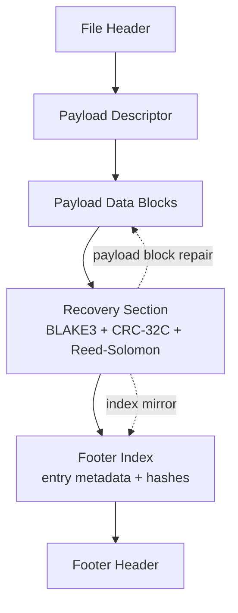
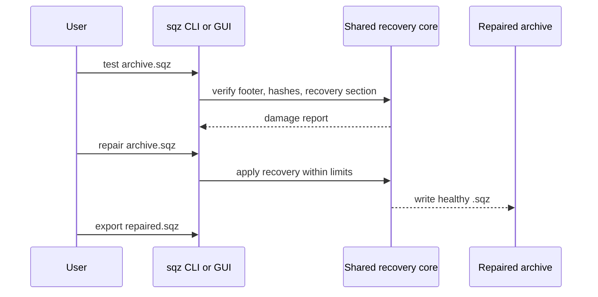

# SQZ Recovery Container / SQZ 自恢复容器

## English

`.sqz` is Squallz's native recovery container. It is designed for archives that should remain inspectable, testable, and repairable without inventing a closed or RAR-compatible format.

## What `.sqz` Supports

- Entry-set containers plus inner `zip`, `tar`, `7z`, and `zstd` profiles.
- Embedded Reed-Solomon recovery over payload blocks.
- Footer-index mirror for supported directory metadata damage cases.
- `RSPC` protection for the recovery section itself.
- `.sqz.001/.002/...` split volumes with `SQZV` headers.
- `.sqz.rev001/.rev002/.rev003` sidecars for split-volume parity.
- Export to ZIP, 7z, TAR, and TAR.ZST through shared engines.

## Repair Flow

## Boundaries

- `.sqz.revNNN` is Squallz-owned parity metadata. It is not RAR `.rev`.
- Squallz does not create RAR and does not implement RAR recovery records.
- Repair succeeds only when damage is within the container's documented recovery limits.
- Encrypted archives still require the correct password.

Specification: [docs/sqz-container-format-v1.md](https://github.com/yangzhg/Squallz/blob/main/docs/sqz-container-format-v1.md)

## 中文

`.sqz` 是 Squallz 的原生恢复容器。它面向长期保存和损坏恢复场景，但不走封闭格式，也不冒充 RAR recovery record。

## `.sqz` 支持什么

- 支持条目集合容器，以及 `zip`、`tar`、`7z`、`zstd` 内部 profile。
- 对 payload block 写入内嵌 Reed-Solomon 恢复数据。
- Footer Index 镜像可在部分目录损坏场景中恢复条目元数据。
- `RSPC` 保护层用于保护 Recovery Section 自身。
- `.sqz.001/.002/...` 分卷带 `SQZV` 小头。
- `.sqz.rev001/.rev002/.rev003` 为分卷 parity sidecar。
- 可通过共享 engine 导出到 ZIP、7z、TAR、TAR.ZST。

## 修复流程

1. 先运行 `sqz test archive.sqz --json` 或在 GUI 中测试压缩包。
2. 如果报告显示在恢复能力内，运行 `sqz repair archive.sqz -o repaired.sqz --json`。
3. 需要通用格式时，运行 `sqz export repaired.sqz -o repaired.zip --json`。

## 边界

- `.sqz.revNNN` 是 Squallz 自有 parity 元数据，不是 RAR `.rev`。
- Squallz 不创建 RAR，也不实现 RAR recovery record。
- 只有损坏在容器文档化恢复能力内时，修复才会成功。
- 加密压缩包仍然需要正确密码。

规范见：[docs/sqz-container-format-v1.md](https://github.com/yangzhg/Squallz/blob/main/docs/sqz-container-format-v1.md)
